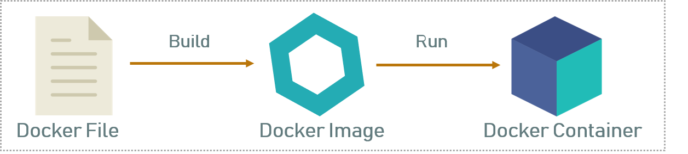

# Les concept de Docker 

Docker repose sur plusieurs concepts clés qui permettent de comprendre son
fonctionnement et son utilité. Voici les concepts de base associés à Docker :
-  **Image** : Une image Docker est un modèle immuable utilisé pour créer un
conteneur. Elle contient le code source de l'application, les bibliothèques, les
dépendances et autres fichiers nécessaires à l'exécution de l'application.
- **Dockerfile** : C'est un fichier de script qui contient les instructions pour
construire une image Docker.
- **Conteneur** : Un conteneur est une instance exécutable d'une image Docker. Il
s'agit d'une encapsulation légère d'une application et de son environnement
d'exécution, fonctionnant de manière isolée sur le système hôte.

- **Registry** : Zone de stockage pour les images Docker. Il peut être public ou privé
(pour une utilisation interne en entreprise par exemple). Docker Hub est un
service cloud public pour partager et stocker des images Docker. C'est comme
un "GitHub" pour les images Docker, où les développeurs peuvent push ou pull
des images.
- **Volume** : Les volumes sont utilisés pour persister les données et partager des
fichiers entre le conteneur et l'hôte. Ils sont essentiels pour éviter la perte de
données lorsque les conteneurs sont arrêtés ou supprimés.
- **Réseau Docker** : Docker possède sa propre gestion du réseau, permettant aux
conteneurs de communiquer entre eux et avec des ressources extérieures. Il
offre plusieurs modes réseau comme "bridge","host" et"overlay"
- **Docker Compose** : C'est un outil pour définir et gérer des applications
multi-conteneurs. Avec Docker Compose, on peut définir une application à
l'aide de plusieurs conteneurs dans un seul fichier, puis démarrer ces conteneurs
simultanément avec une seule commande. Par exemple, vous voulez déployer
une application PHP qui utilise une base de données MySQL. Vous allez écrire
un fichier docker-compose qui va décrire la configuration du conteneur pour
PHP et le conteneur MySQL. Cela va éviter de lancer les commandes à la main
et permettre d’avoir un suivi dans Git.

**Livrables**
    
    Trouver un Livrable